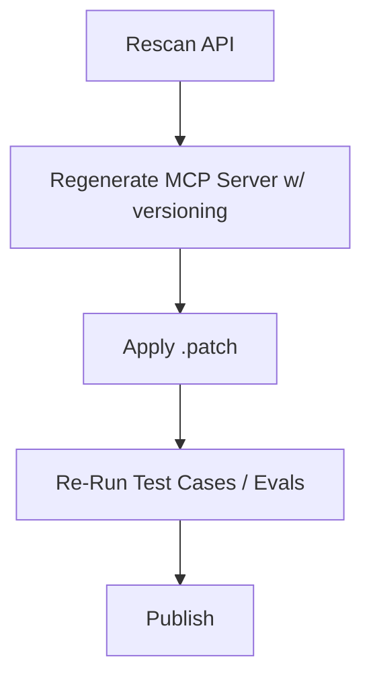

A continuation of the previous blog post.

<!-- truncate -->

#### Can we shrink the size of the model using fine-tuning, LoRa and quantization to fit on a Raspberry Pi 4 with reasonable performance?

The quest to run meaningful AI on a Raspberry Pi 4 led us down a rabbit hole of quantization and LoRA (Low-Rank Adaptation). While we were knee-deep in the research, it turns out we didn't get this running to our own satisfaction. Others in the open-source community beat us to the solution, providing robust implementations that far exceeded our initial prototypes. We'll not complain and just accept their work, as it allows us to focus on the next layer of the stack: private orchestration.

### The Pim Particle Effect: Linguistic Dimensions

The "Pim Particle" concept remains relevant as a way to think about semantic compression. By using actual previous calls to confirm the linguistic dimensions of possible intent, we can effectively shrink the search space required for an agent to take action.

To maintain these local agents, we've developed a self-healing MCP (Model Context Protocol) server workflow:

This ensures that even when running smaller, "shrunken" models, the tools they interact with are always up-to-date and verified.

<!-- *This post was cleaned up with Automation to clarify thoughts for the reader.* -->
