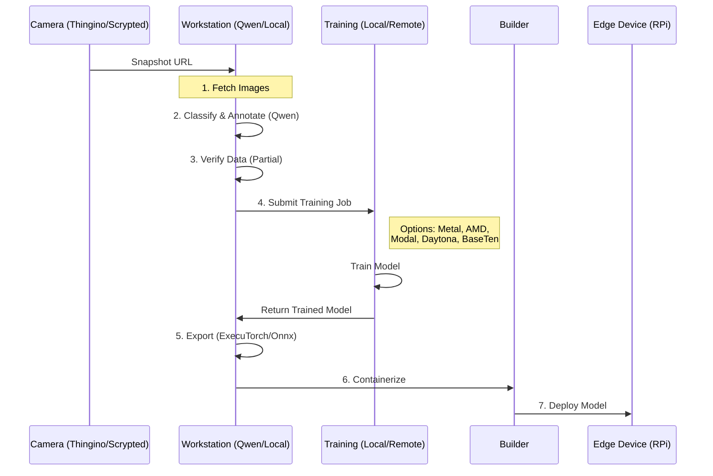

Due to competing priorities, getting our first "baby" model out the door on ExecuTorch took far longer than anticipated. 

## What does the model do? 
The model monitors a webcam powered by [Thingino](https://thingino.com/) and served to homekit via [scrypted](https://www.scrypted.app/) and come to two predictions that are published to MQTT (and then [mqtt-things](https://github.com/arachnetech/homebridge-mqttthing) will export to HomeKit via [Homebridge](https://homebridge.io/)):
- Door Open/Closed
- Car Home/Away

{/* truncate */}

Please see the post from last year on [GarageCam](./2025-09-15-GarageCam-updated.md)


## How does it run?

- **RaspberryPi 5** - set to poll every 30s.
- **RaspberryPi 4** - Currently sidelined due to a build mismatch. 

The underlying code maps PyTorch operations to specific CPU sets via ExecuTorch, but this process is currently error-prone. Aligning the right instruction sets with the target architecture requires precise configuration, which led to the RPi 4 hiccups.

<div style={{fontSize: '0.8em'}}>

```python
2026-02-18 06:01:42,406 [INFO] model_runner.inference: Loading PTE model from /app/model/model.pte
[program.cpp:153] InternalConsistency verification requested but not available
[cpuinfo_utils.cpp:71] Reading file /sys/devices/soc0/image_version
[cpuinfo_utils.cpp:87] Failed to open midr file /sys/devices/soc0/image_version
[cpuinfo_utils.cpp:100] Reading file /sys/devices/system/cpu/cpu0/regs/identification/midr_el1
[cpuinfo_utils.cpp:100] Reading file /sys/devices/system/cpu/cpu1/regs/identification/midr_el1
[cpuinfo_utils.cpp:100] Reading file /sys/devices/system/cpu/cpu2/regs/identification/midr_el1
[cpuinfo_utils.cpp:100] Reading file /sys/devices/system/cpu/cpu3/regs/identification/midr_el1
2026-02-18 06:01:42,408 [INFO] model_runner.inference: PTE model loaded successfully
2026-02-18 06:01:42,408 [INFO] model_runner.mqtt_client: Connecting to MQTT broker mqtt_broker:1883
2026-02-18 06:01:42,412 [INFO] model_runner.mqtt_client: Connected to MQTT broker
2026-02-18 06:01:42,512 [INFO] model_runner.healthcheck: Healthcheck server listening on port 8080
2026-02-18 06:01:42,613 [INFO] model_runner.runner: All components initialized successfully
2026-02-18 06:01:42,613 [INFO] model_runner.runner: Running inference every 10.0s
2026-02-18 06:01:43,281 [INFO] model_runner.camera: ONVIF snapshot URI: http://192.168.000.000/image.jpg
2026-02-18 06:01:44,311 [INFO] model_runner.runner: Debug snapshot saved: /tmp/model_runner_debug/snapshot_20260218_060144.jpg
2026-02-18 06:01:44,326 [INFO] model_runner.state: State change: car_present: UNKNOWN -> OFF (prob=0.198)
2026-02-18 06:01:44,326 [INFO] model_runner.state: State change: door_open: UNKNOWN -> OFF (prob=0.000)
2026-02-18 06:01:44,326 [INFO] model_runner.state: State change: door_closed: UNKNOWN -> ON (prob=0.801)

```

</div>

## How does it perform?

Surprisingly well! The Raspberry Pi 5 handles the inference load with ease:  maintaining a consistent polling interval without thermal or resource issues.

### How efficient is it?:

- **Model Size:** Optimized for edge deployment.
- **CPU Consumed:** Minimal impact on the Pi 5's quad-core processor.
- **Memory Consumed:** Low footprint, leaving plenty of headroom for other services.


While the resource usage is excellent, I'm still refining the observability stack to better track long-term ML accuracy and model drift.

## Does this help avoid [Frigate](https://frigate.video/) / [Scrypted NVR](https://docs.scrypted.app/scrypted-nvr/) fees?

Nope, you should still pay them. Eventually, my answer may change. But not yet without some more observability work and scaling this across cameras. 

## Where is the code?

Next Time - It's not presentable to the public (yet) largely as there is still a lot of hard-coded stuff with PII that I want to remove. 

### ExecuTorch and the CompileVM

Rather than bloat my main workstation with cross-compilation support, I've added a QEMU/UTM Debian VM for compiling the python wheels for executorch. This will be factored out of the main repo, as a more generic solution.

* NB: I have a compile container as well, but in principle I could have run this on an x86 box so it wasn't a generic cross-compile / arch agnostic pipeline.

### Did [PyLightning](https://lightning.ai/pytorch-lightning) help?

Tremendously versus straight pytorch. At some point, I need to dig into what is going on under the hood. 

### Did AI Assist with the coding / testing / design?

Yes. It was used for boilerplate and autocomplete. Sadly, as some of the Tech ([Executorch](https://pytorch.org/executorch/)/[Onnx](https://onnx.ai/)/[TFLite](https://www.tensorflow.org/lite)), [Daytona](https://daytona.io/), BaseTen and [Modal](https://modal.com/) was not familiar to me. Gemini / Opus / Grok and friends helpfully jumped in to help - but the subtle bugs hurt, a lot.

## How does this really help?

I've done nothing special here - but it opens the door to to a generic home-ml pipeline of using bigger Teacher models to train smaller student models that can run on non-specialized hardware thanks to the efforts of many. While part of broader vision of Private AI, the most germane ideas here for stationary cameras:




## Next Steps for GarageCam
- Model Perf Tracking
  - Need to add in Sentry (Arize), etc 
- Model Architecture
  - See next post in frontier(s) - where I may reveal my ignorance.
- Model Inference Footprint 
  - Fix the RPI4
  - See about other smaller processors
- Add in Bounding / Labelling / Masking of Private Data with the local Teacher
  - Once properly data masked, Daytona/Modal/Baseten/Lightning etc are GREAT for beefy training  
- Additional Multi-Modal Differential Privacy topics are a break out project (*)
  - i.e. How much noise can be added to the picture without breaking the classifier?
  - What about audio?
