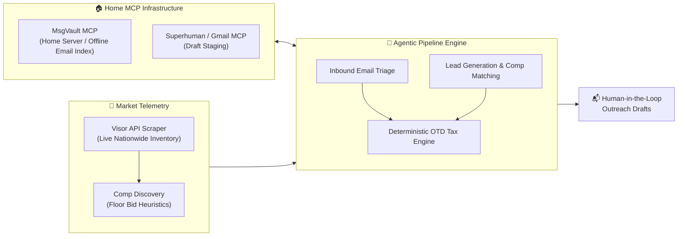

# Applied Home ML/IoT: Taking Agentic Workflows to the Real World

*Is negotiating a car purchase a home IoT project?*

Look, it’s a stretch. If your definition of Home Automation is strictly zigbee plugs turning on Hue lights at sunset, this article is going to feel like an eccentric tangent. 



But if you view the home through the lens of **Home Operations (Home-Ops)**—managing high-capital household procurement, local communication servers, and private automation infrastructure without surrendering personal data—then automotive acquisition is the ultimate boss fight.

We just placed a deposit on a brand-new vehicle after running an agentic pipeline from the terminal. Here is how we orchestrated local Model Context Protocol (MCP) servers, live market telemetry, and deterministic financial guardrails to negotiate with dealerships without ever setting foot in a showroom.

<!-- truncate -->

---

## The Problem: The Asymmetry of Car Buying

Buying a high-demand family car (in our case, evaluating the 2026 Toyota Grand Highlander Hybrid, Lexus TX 350, and Chrysler Pacifica Pinnacle) is an exercise in intentional information asymmetry. Dealerships rely on:
1. **Hidden Fees & Inflated Out-The-Door (OTD) Pricing:** Quoting an attractive vehicle selling price online, then tacking on $1,500 conveyance fees, paint protection packages, and doc markups.
2. **Emotional & Fatigue Exploitation:** Dragging out email threads, withholding inventory arrival windows, and demanding phone calls.
3. **Market Fragmentation:** Pricing in your immediate 15-mile radius might be marked up $5,000 over MSRP, while a volume dealer three states away is advertising $4,000 below sticker.

To beat this asymmetry, we didn't need another generic consumer buying guide. We needed **market telemetry, mathematical discipline, and agentic leverage**.

---

## The System Architecture

Instead of letting an LLM blindly write sales emails, we separated **deterministic financial math** from **language generation**:

### 1. Market Telemetry & Dealership Verification
Our pipeline queries live nationwide dealer inventories via Visor.vin. Crucially, dealers hate third-party listing links—they want to see their own stock. Our agent extracts the listing, follows redirects, and discovers:
- Direct Dealership Vehicle Detail Page (VDP) URLs
- Official dealership website and direct contact forms
- Sales department direct phone numbers and addresses
- Benchmark comp URLs from lowest-cost competitors across the country

### 2. The Opening Floor Bid Heuristic
Never anchor to MSRP. Dealerships celebrate when you ask for "MSRP on a hybrid." Instead, the engine computes an **Opening Floor Bid OTD**:
$$\text{Floor Bid OTD} = \text{Cheapest National Benchmark Price} + \text{Local Capped Doc Fee} + \text{State Sales Tax} + \text{DMV Reg}$$

When reaching out to a local dealer, the pitch is anchored to that floor:
> *"I'm interested in your Grand Highlander Hybrid Limited (VIN: ...) at a firm OTD of $58,450.85. Diehl Toyota has an identical unit listed at $52,500. If you can match their pricing locally and save me the drive, I will submit a deposit today."*

### 3. Local Comms: Pluggable MCP & MsgVault
Dealer replies arrive via email. Rather than polling webmail manually:
- **Inbound Triage:** Indexed via our self-hosted **MsgVault MCP server** running on the local home network. It searches incoming dealer replies, detects forwarded mask headers (e.g., Firefox Relay / Mozmail), and flags price adjustments.
- **Outbound Draft Staging:** The agent formats responses and pushes them directly into **Superhuman Drafts** or **Gmail Drafts** via MCP. 
- **The Golden Rule:** The agent **never sends autonomously**. It stages drafts with calculated spreads, monthly finance amortization tables, and fee breakdowns. The human glances at the numbers and clicks "Send."

---

## When a Dealer Fights Back: Real-World Triage

During our run, an inbound lead arrived from a dealership quote sheet:
- **Vehicle Quoted:** 2026 Grand Highlander Hybrid MAX Limited (allocation build date October 12th).
- **Selling Price:** $63,827.00.
- **Dealer Conveyance / Fees:** $1,252.00.
- **Total Cash Out-The-Door:** $70,095.27.
- **Financing:** 4.99% for 48 months = $1,609 / month ($77,232 total payments!).

Within seconds, our triage command (`python3 scripts/pipeline.py triage`) surfaced the divergence:
1. **Powertrain Mismatch:** Quoted unit was a 2.4L Turbo Hybrid MAX (27 MPG combined), deviating from our target 2.5L Hybrid (36 MPG).
2. **OTD Spread:** $70,095.27 vs. our baseline target of $58,450.85 — an instantaneous **+$11,644 (+19.9%) premium**.
3. **Financing Penalty:** Quoting $1,609/month vs. the TFS 2.0% promotional benchmark of $1,241.50/month (a **+$17,640 financing penalty** over 48 months).

Instead of an emotional phone debate, the agent staged an itemized counter-worksheet rejecting the markup, pointing out the fuel economy divergence, and establishing our hard cap.

Two weeks later, an allocation matching our exact preferred spec arrived at our target OTD—and the reservation was locked in.

---

## Repackaging for the Community: Hermes & Antigravity

Now that our transaction is secured, we have generalized the codebase so anyone can use it without our personal configs or private servers:
- **Universal Configuration:** Persona details (first name, zip code, state tax rate, statutory doc fee caps) live in a single `config/buyer_profile.json`.
- **Pluggable MCP Backends:** Outbound drafting works out-of-the-box with **Superhuman MCP**, official **Gmail MCP**, or an offline dry-run **Mock** client.
- **Optional Inbound:** MsgVault is strictly optional; if unconfigured, it gracefully skips inbound indexing or routes via Gmail search.
- **Dual-Agent Compatibility:** Fully packaged as an **Antigravity Skill** (`.agents/skills/car_deal_pipeline`) and ready to install into **Hermes-Agent** (`~/.hermes/skills/car_deal_pipeline`) using our one-command installer:

```bash
./scripts/install_hermes_skill.sh
```

Check out the project repository, drop in your target VINs and floor OTD numbers, and let your terminal do the dealership heavy lifting.
