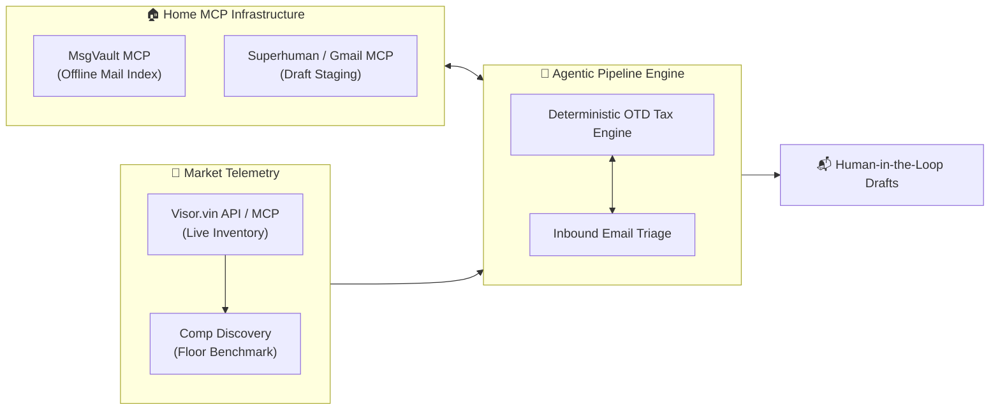

# Applied Home ML/IoT: Real-World Dealership Negotiation from the Terminal

*Is negotiating a car purchase a home IoT project?*

It’s a stretch—unless you view the home through **Home Operations (Home-Ops)**: managing high-capital household procurement via private, local infrastructure without leaking personal data.

We just reserved a new vehicle after running an agentic pipeline from the terminal—orchestrating the **Visor.vin API / MCP server**, local **MsgVault**, and email MCP tools to beat dealership information asymmetry.



<!-- truncate -->

---

## Architecture & Heuristics

Instead of letting an LLM hallucinate sales correspondence, we enforced strict separation of concerns:

1. **Market Telemetry:** Queries live nationwide dealer inventory via the **Visor.vin API / MCP server**, resolving direct dealership Vehicle Detail Pages (VDP), contact forms, and competitor comp URLs.
2. **Opening Floor Bid:** Never anchor to MSRP. The engine computes a firm floor:  
   `Floor Bid OTD = Lowest National Benchmark + Local Capped Doc Fee + State Tax + DMV Reg`  
   Outreach pitches anchor directly to this number backed by verified competitor comp URLs.
3. **Pluggable MCP & Strict Safeguards:**
   - **Inbound Triage:** Indexed via local MsgVault MCP (or Gmail search fallback).
   - **Outbound Staging:** Drafts are staged into Superhuman or Gmail via MCP.
   - **Human-in-the-Loop:** The agent **never sends emails** autonomously and has zero access to payment rails. A human reviews every worksheet and clicks Send.

---

## Real-World Triage

When a dealer sent an allocation quote sheet, `python3 scripts/pipeline.py triage` instantly flagged:
- **Spec Mismatch:** Quoted 2.4L Turbo Hybrid MAX (27 MPG) vs. our target 2.5L Hybrid (36 MPG).
- **OTD Spread:** $70,095 quote vs. $58,451 target—a **+$11,644 (+19.9%) markup**.
- **Payment Gap:** Quoted $1,609/mo (4.99% for 48 mo) vs. $1,241.50/mo on our subsidized benchmark (+ $17,640 total payment gap).

The agent staged an itemized counter-worksheet rejecting the markup. Two weeks later, an allocation matching our exact spec arrived at our target OTD.

---

## Portable Skill

We packaged the engine as a universal skill compatible with both **Antigravity** (`.agents/skills/car_deal_pipeline`) and **Hermes-Agent** (`~/.hermes/skills/car_deal_pipeline`):

```bash
./scripts/install_hermes_skill.sh
```

Get the skill on GitHub: [5L-Labs/agent-skills](https://github.com/5L-Labs/agent-skills).
