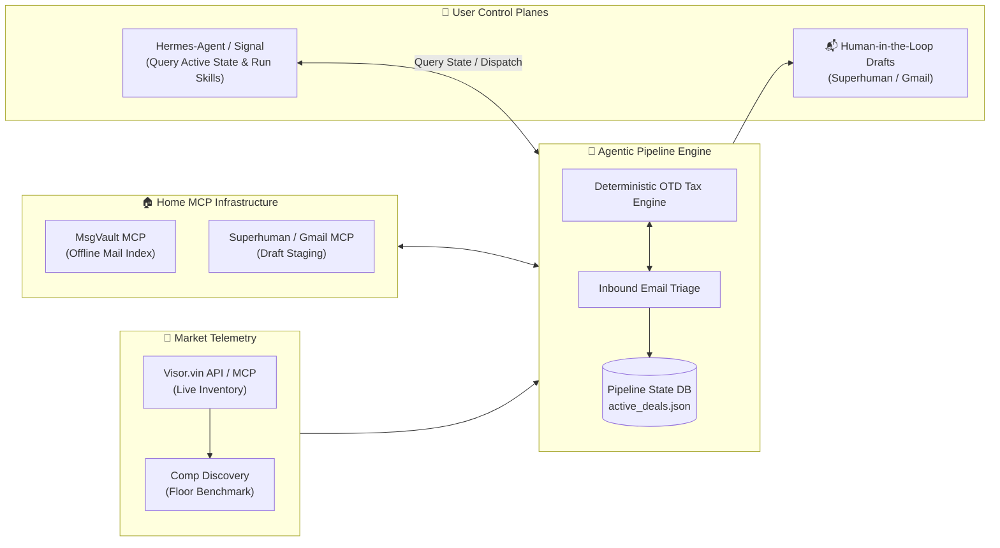

# Dear Lord Why?

Because I hate *knowing* that the Car Dealership is screwing me *AND* I have buying constraints on acceptable models / controls. Rather than build the Dealer API integration myself, after some complaining on Reddit, I stumbled upon [Visor.vin](https://visor.vin) (built by Colin and the team, reachable at [brothers@visor.vin](mailto:brothers@visor.vin)).

### Was there a happy ending?

Yes. I'm scheduled to take possession of a [Toyota Grand Highlander](https://www.toyota.com/grandhighlander/) 2026 Hybrid Nightshade in November.


*2026 Toyota Grand Highlander Hybrid Nightshade Edition (Midnight Black Metallic)*

### What was hard about it?

Getting consistency between Hermes and Gemini to execute the skill consistently across agent runtimes using the [AgentSkills specification](https://github.com/5L-Labs/agent-skills).

### *Is negotiating a car purchase a home IoT project?*

It’s a stretch—unless you view the home through **Home Operations (Home-Ops)**: managing high-capital household procurement via private, local infrastructure without leaking personal data.

### Components:

1. **Live Mailbox ([Superhuman](https://mcp.mail.superhuman.com/mcp) | [Gmail MCP](https://gmailmcp.googleapis.com/mcp/v1)):** For staging and reviewing outbound dealer drafts with human-in-the-loop oversight.
2. **[msgvault](https://github.com/NickJLange/msgvault) (Our Local Fork):** Offline sync of mail, minimizing upstream MCP/API calls to mail providers, with an Nginx TLS terminator in front of the local MCP daemon.
3. **[Visor.vin API](https://visor.vin/account/api):** Spun up by Colin, pulled this all together and removed the need to scrape dealer websites with agents.

### General Flow Chart:



<!-- truncate -->

---

## Architecture & Heuristics

Instead of letting an LLM hallucinate sales correspondence, we enforced strict separation of concerns:

1. **Market Telemetry:** Queries  nationwide dealer inventory via the **Visor.vin API / MCP server**, resolving direct dealership Vehicle Detail Pages (VDP), contact forms, and competitor comp URLs.
2. **Opening Floor Bid:** Never anchor to MSRP. The engine computes a firm floor:  
   `Floor Bid OTD = Lowest National Benchmark + Local Capped Doc Fee + State Tax + DMV Reg`  
   Outreach pitches anchor directly to this number backed by verified competitor comp URLs.
3. **Pluggable MCP & Strict Safeguards:**
   - **Inbound Triage:** Indexed via local MsgVault MCP (or Gmail search fallback).
   - **Outbound Staging:** Drafts are staged into Superhuman or Gmail via MCP.
   - **Human-in-the-Loop:** The agent **never sends emails** autonomously and has zero access to payment rails. A human reviews every worksheet and clicks Send.

---

## Real-World Triage

When a dealer sent an allocation quote sheet, running the `negotiator` skill (`python research/negotiator/scripts/finance_engine.py` paired with `negotiator_tool.py`) instantly flagged:
- **Spec Mismatch:** Quoted 2.4L Turbo Hybrid MAX (27 MPG) vs. our target 2.5L Hybrid (36 MPG).
- **OTD Spread:** $70,095 quote vs. $58,451 target—a **+$11,644 (+19.9%) markup**.
- **Payment Gap:** Quoted $1,609/mo (4.99% for 48 mo) vs. $1,241.50/mo on our subsidized benchmark (+ $17,640 total payment gap).

The agent staged an itemized counter-worksheet rejecting the markup. Two weeks later, an allocation matching our almost exact spec arrived at our target OTD. But the Color was wrong.... **FAIL**

---

## Open-Source Skills

The modular skills powering this workflow are published in the [5L-Labs/agent-skills](https://github.com/5L-Labs/agent-skills) repository under `research/`:

- **[`research/car_tracker`](https://github.com/5L-Labs/agent-skills/tree/main/research/car_tracker):** Daily market bulletin scanner built on `publish_deals.py` that polls the Visor API for new arrivals, caches seen inventory in local state, and highlights target trims against baseline OTD targets:
  ```bash
  python research/car_tracker/scripts/publish_deals.py
  ```
- **[`research/negotiator`](https://github.com/5L-Labs/agent-skills/tree/main/research/negotiator):** Automotive finance, True $0 drive-off lease solver, and deterministic OTD bid spread generator:
  ```bash
  python research/negotiator/scripts/finance_engine.py --msrp 58448 --tax-rate 0.08875 --doc-fee 175.00
  ```
- **[`research/nhtsa_lookup`](https://github.com/5L-Labs/agent-skills/tree/main/research/nhtsa_lookup):** Automated VIN decoder using the public NHTSA VPIC API to verify exact trim, engine, and drivetrain specs.

Both skills follow the universal AgentSkills format, allowing them to be loaded directly into **Antigravity** or **Hermes-Agent**.
