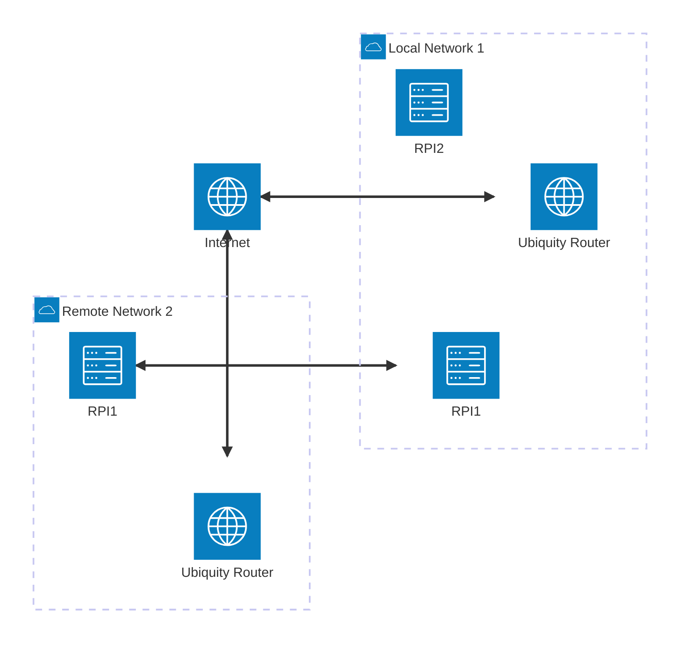

This post will evolve to cover the basics of setting up a private home network between multiple locations using wireshark and ensuring that traffic follows the right path.

<IIcon icon="arcticons:unifi-network" height="48" />  All routers are currently ubiquity, although they may be replaced with other more private brands should their be any issues with phone-home discovered.

### Outstanding Details

- Outstanding documentation Items
- Add more details about the network architecture
- Include diagrams and screenshots of the setup
