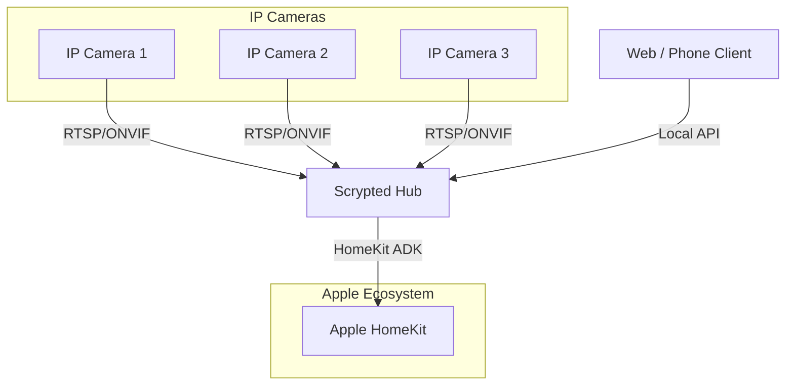

Transitioning away from Wyze's cloud-dependent firmware toward local-only protocols is a major step in building a private home. The goal is to eliminate the need for external servers for live feeds and motion alerts, ensuring that my data stays under my roof.

<!-- truncate -->

### Conversion Strategy

- **Battery Cam Protocol**: Moving to cameras that support local RTSP/ONVIF streams instead of proprietary battery-saving protocols that require cloud-based "wake-ups" to function.

:::warning

- **NOTE** battery-backed cameras have not been cracked yet. 

:::

- **Legacy Support**: Repurposing older hardware with [Thingino](https://thingino.com/) or [Scrypted](https://www.scrypted.app/) to bypass the manufacturer's cloud limits and proprietary app requirements.

### The Role of the Scrypted Hub

The "Hub" in the diagram represents [Scrypted](https://www.scrypted.app/), which acts as a bridge between my local IP cameras and HomeKit. It handles the local heavy lifting of motion detection and recording (HKSV), ensuring zero-latency access within the Apple ecosystem without any data ever leaving the house. This setup allows me to use any high-quality IP camera as if it were a native, high-privacy HomeKit device.

<!-- *This post was cleaned up with Automation to clarify thoughts for the reader.* -->
