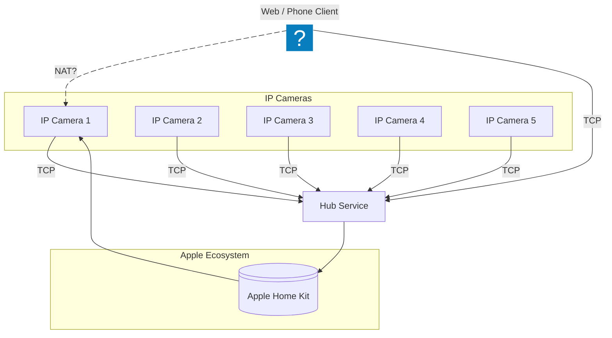

Getting more private from Wyze:
 * Battery Cam Protocol
 * Non-Recent Cameras

### Outstanding Details

- Outstanding documentation Items
- Add more details about the network architecture
- Include diagrams and screenshots of the setup
