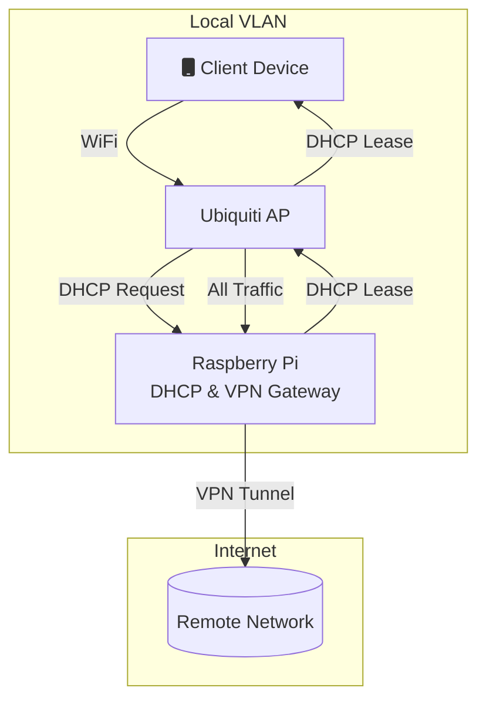

With the cold and the early darkness, it's time for more TV than less. With that in mind, I needed to fix a few things that "broke" over the last few months. This entry is more of a mental dump so that in the future I can remember what I did to fix things.


## Future Idea:
Move to an 802.11 trunked VLAN and serve DHCP/VPN tunneling from a single RPi.


## NetworkManager 

I thought it was Debian Bookworm, but Trixie finally forced me into a shotgun wedding with NetworkManager (NM). I'm going to rely on Ansible wrappers for interface configuration, but I haven't yet automated this so:

### Static IP Configuration with nmcli looks like this:
```bash 
           $ nmcli con add con-name my-con-em1 ifname em1 type ethernet \
             ip4 192.168.100.100/24 gw4 192.168.100.1 ip4 1.2.3.4 ip6 abbe::cafe
           $ nmcli con mod my-con-em1 ipv4.dns "8.8.8.8 8.8.4.4"
```

### DNSMasq DHCP
A nice feature of Ubiquiti is that it can act as a meshed AP and let one of the Raspberry Pis be the gateway for that VLAN. 

### Network Forwarding
This needs to be more granular and live in the playbook for the interface.
```bash
sysctl -w net.ipv4.ip_forward=1
```



## The Other Problem(s)

### Mixed up switch VLANs

Upgrading to the PoE 2.5 GHz switch, I swapped wires and mixed up the DHCP-addressable VLANs, so Remote2 was booting on Remote1 and vice-versa. 


### Stale WireGuard Connections
One of the endpoints changed IPs, which required a DNS update and a tunnel restart. I've been too lazy to automate the end-to-end of this workflow, so we'll just have to fix it when it breaks.

## WireGuard General Config


### Entry Point
```ini
root@local:/etc/NetworkManager/dnsmasq.d# cat /etc/wireguard/remote_gateway.conf 
[Interface]
Address = 10.253.120.7/32
ListenPort = 21001
PrivateKey = #<cat privatekey>


#local Gateway Entrance
[Peer]
Endpoint = <gateway-domain>:XXXXXXX
PublicKey = #<cat privatekey | wg pubkey>
AllowedIPs = 0.0.0.0/0,::/0
```

### Exit Point
```ini
root@remote:~# cat /etc/wireguard/wg0.conf 
[Interface]
#Address = 10.253.120.1/32, fd02:e6c1:d3b9:bca7:0070::1/76
Address = 10.253.120.1/32
ListenPort = 21001
PrivateKey = #<cat privatekey>
PostUp = nft add chain ip nat POSTROUTING '{ type nat hook postrouting priority 100; }'
PostUp = nft add rule ip nat POSTROUTING ip saddr 192.168.31.0/24 oif eth0 masquerade
PreDown = nft -j list ruleset ip | jq '.nftables[] | select (.rule.chain == "POSTROUTING" and (.rule.expr[2] | has("masquerade"))) | .rule.handle'  | while read handle; do nft delete rule ip nat POSTROUTING handle $handle;done


# Remote Gateway
[Peer]
PublicKey = #<cat privatekey | wg pubkey>
AllowedIPs = 10.253.120.7/32,192.168.131.0/24

#laptop
[Peer]
PublicKey = <laptop-public-key>
AllowedIPs = 10.253.120.2/32,fd02:e6c1:d3b9:bca7::2/128
```
