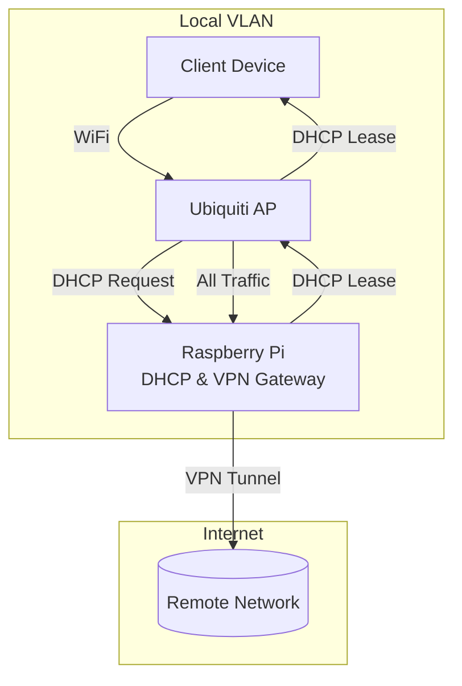

With the cold and the early darkness, it's time for more TV than less. With that in mind, I needed to fix a few things that "broke" over the last few months. This entry is a technical "brain dump" to document the NetworkManager and WireGuard configurations required to maintain a private, multi-site network.

<!-- truncate -->

## Future Architecture: VLAN Trunking
The goal is to move to an **802.1Q trunked VLAN** on the Raspberry Pi, allowing a single ethernet cable to carry multiple isolated networks. The Pi would then act as a central DHCP and VPN gateway for each, providing a clean and scalable home networking backbone.

## NetworkManager on Debian Trixie

I thought it was Debian Bookworm, but Trixie finally forced me into a shotgun wedding with **NetworkManager (NM)**. While I initially resisted, the unified CLI (`nmcli`) for managing Wi-Fi, ethernet, and VPN interfaces is actually quite powerful once you get past the initial learning curve.

### Static IP Configuration with nmcli
To set up a reliable static IP for a local gateway:
```bash 
$ nmcli con add con-name my-con-em1 ifname em1 type ethernet \
  ip4 192.168.100.100/24 gw4 192.168.100.1
$ nmcli con mod my-con-em1 ipv4.dns "1.1.1.1 8.8.8.8"
$ nmcli con up my-con-em1
```

### DHCP and Network Forwarding
A nice feature of the Ubiquiti ecosystem is that it can act as a meshed AP, allowing a Raspberry Pi to serve as the DHCP server and gateway for a specific VLAN. This requires enabling IPv4 forwarding:
```bash
sysctl -w net.ipv4.ip_forward=1
```



## The Other Problem(s)

### Stale WireGuard Connections
When a remote endpoint changes its public IP, the WireGuard tunnel can become stale. While I've been manual about restarts so far, a [Systemd Timer](https://www.freedesktop.org/software/systemd/man/latest/systemd.timer.html) combined with a simple health check script (pinging the remote gateway) could easily automate this recovery workflow.

### WireGuard Configuration: The Gateway Entrance
```ini
[Interface]
Address = 10.253.120.7/32
ListenPort = 21001
PrivateKey = <local-private-key>

[Peer]
Endpoint = <gateway-domain>:21001
PublicKey = <remote-public-key>
AllowedIPs = 0.0.0.0/0, ::/0
PersistentKeepalive = 25
```

<!-- *This post was cleaned up with Automation to clarify thoughts for the reader.* -->
